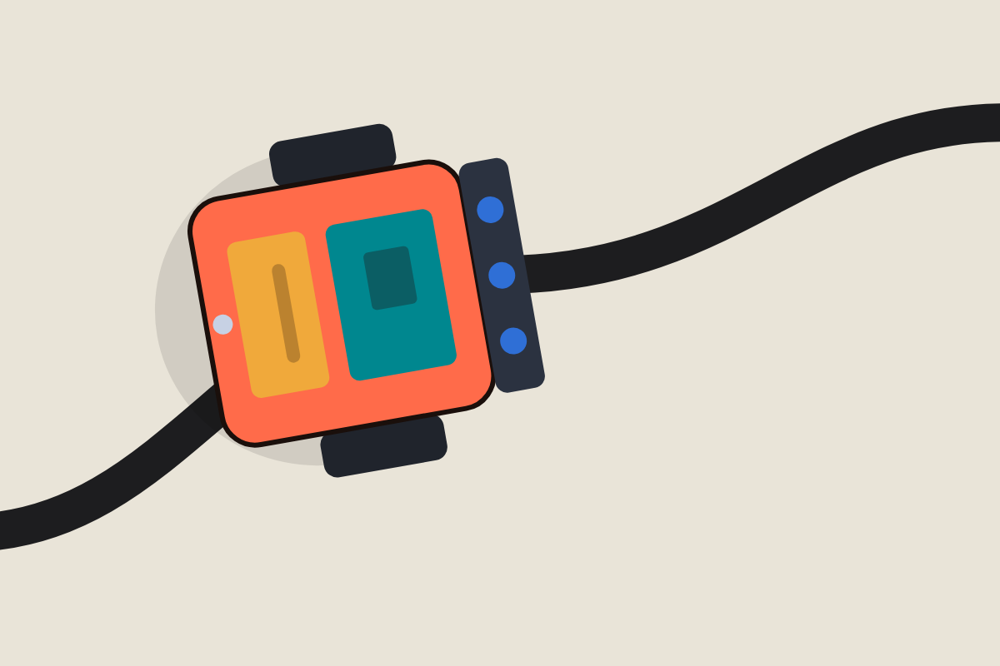

# Line-following robot

A small robot that follows a black line, built for a mechatronics class.

## Parts

- Arduino Uno
- L298N motor driver
- 2 DC motors with wheels
- 3 infrared line sensors (TCRT5000)
- 7.4 V Li-ion battery

## How it works

Three sensors read the floor. When the black line is under the center sensor, the robot drives straight. When the line drifts left or right, the robot turns toward it. The settings are at the top of `robot.ino`:

| Setting | Value | What it does |
|---|---|---|
| `SPEED` | 200 | Speed on straights (0-255) |
| `TURN_SPEED` | 120 | Speed in turns |
| `THRESHOLD` | 500 | Readings above this count as the black line |

## Wiring

Circuit diagram: [circuit.png](circuit.png)

| Part | Arduino pin |
|---|---|
| L298N ENA / ENB (motor speed) | 5 / 6 |
| L298N IN1, IN2, IN3, IN4 (direction) | 7, 8, 9, 10 |
| Left / center / right sensor | A0 / A1 / A2 |

## Files

- `robot.ino`: Arduino code
- `circuit.png`: wiring diagram
- `project-report.pdf`: project report
- `photos/`: pictures of the robot

## Team

[Your Name] · Mechatronics Engineering
